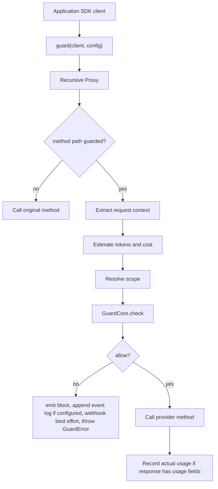

# AI CostGuard Architecture

This document describes the implementation that ships in `@salimassili/ai-costguard`.

## Package Boundaries

- Root import: `@salimassili/ai-costguard`
  - `guard`
  - `guardFunction`
  - `GuardError`
  - `middleware`
  - pricing helpers
  - public config/event/context types
- Pro import: `@salimassili/ai-costguard/pro`
  - `GuardPro`
  - Redis client types
  - deprecated license compatibility helper
- Pricing import: `@salimassili/ai-costguard/pricing`
  - pricing registry helpers

Redis is intentionally isolated behind `/pro` so free core users do not load `ioredis` on root import.

## Runtime Flow

`guardFunction(fn, config)` adapts function-style SDKs into the same `GuardCore` flow by protecting a synthetic `run` method.

## Guarded Methods

Default method paths:

- `chat.completions.create`
- `completions.create`
- `responses.create`
- `messages.create`

Applications can replace this list with `guardedMethods`.

## Scope Model

Scopes isolate budget and behavior history. A scope can include:

- `projectId`
- `userId`
- `sessionId`

If no scope is configured, all calls use the `default` scope. Prompt and retry histories are pruned by `historyTtlMs`.

## Accounting Model

The guard tracks estimates before provider execution:

- `attemptedCost`: all guarded attempts
- `totalCost`: allowed estimated spend
- `blockedCost`: estimated spend blocked before provider execution
- `actualCost`: provider-reported usage when available

Budget enforcement uses estimated allowed spend because the decision happens before the provider call.

## Behavior Detection

Loop detection uses character trigram cosine similarity. A prompt is blocked when at least `loopMinRepeats` recent prompts in the same scope exceed `loopSimilarityThreshold`.

Retry detection uses conservative retry/failure keywords and scoped retry history. It is heuristic and intentionally configurable.

## Local Dashboard

`eventLogPath` enables opt-in JSONL event records. Prompt text is redacted unless `eventLogPrompt: 'preview'` is set.

The CLI `dashboard` command reads that local file and serves a small HTTP view on `127.0.0.1` by default. It does not send telemetry or aggregate data across machines.

## Non-Goals

This repository does not currently ship:

- hosted dashboards
- proxy server
- API-key authentication layer
- multi-tenant SaaS control plane
- persistent prompt database
- provider billing reconciliation
- semantic embedding loop detection
