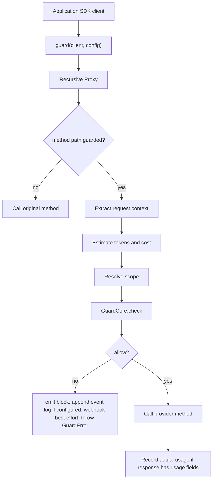

# AI CostGuard Architecture

This document describes the implementation that ships in `@salimassili/ai-costguard`.

## Package Boundaries

- Root import: `@salimassili/ai-costguard`
  - `guard`
  - `guardFunction`
  - `GuardError`
  - `middleware`
  - pricing helpers, including `getPricingMeta`
  - `registerTokenizer`
  - public config/event/context types
- Pro import: `@salimassili/ai-costguard/pro`
  - `GuardPro`
  - Redis client types
- Pricing import: `@salimassili/ai-costguard/pricing`
  - pricing registry helpers

Redis is intentionally isolated behind `/pro` so free core users do not load `ioredis` on root import.

## Runtime Flow

```mermaid
flowchart TD
  A["Application SDK client"] --> B["guard(client, config)"]
  B --> C["Recursive Proxy"]
  C --> D{"method path guarded?"}
  D -- "no" --> E["Call original method"]
  D -- "yes" --> F["Extract request context"]
  F --> G["Estimate tokens and cost"]
  G --> H["Resolve scope"]
  H --> I["GuardCore.check"]
  I --> J{"allow?"}
  J -- "no" --> K["emit block, append event log if configured, webhook best effort, throw GuardError"]
  J -- "yes" --> L["Call provider method"]
  L --> M["Record actual usage if response has usage fields"]
```

`guardFunction(fn, config)` adapts function-style SDKs into the same `GuardCore` flow by protecting a synthetic `run` method.

## Guarded Methods

Default method paths:

- `chat.completions.create`
- `completions.create`
- `responses.create`
- `messages.create`

Applications can replace this list with `guardedMethods`.

## Scope Model

Scopes isolate budget and behavior history. A scope can include:

- `projectId`
- `userId`
- `sessionId`

If no scope is configured, all calls use the `default` scope. Prompt and retry histories are pruned by `historyTtlMs`. Scope keys use structured serialization rather than delimiters. Identifiers are bounded to 256 characters and new process-local scopes are blocked after `maxScopes` (default 10,000) so budget state is never silently evicted.

## Accounting Model

The guard tracks estimates before provider execution:

- `attemptedCost`: all guarded attempts
- `reservedCost`: estimated cost reserved for allowed requests and used for budget enforcement
- `totalCost`: compatibility alias for `reservedCost`
- `blockedCost`: estimated spend blocked before provider execution; never actual spend
- `actualCost`: provider-reported usage when available, emitted as `usage` events after successful provider responses

Budget enforcement uses estimated reserved spend because the decision happens before the provider call. Reservations remain consumed when a provider call fails. This is intentionally conservative and is not provider invoice reconciliation. Actual usage is additive observability data and is reconciled once per request context.

Streaming requests are rejected before provider execution because the package does not claim safe final-usage reconciliation for async streams.
Guarded requests must provide a finite output token limit (`max_tokens`, `max_completion_tokens`, `maxTokens`, or `max_output_tokens`); requests without one are rejected with `OUTPUT_LIMIT_REQUIRED` rather than assigned an arbitrary default.

## Behavior Detection

Loop detection uses character trigram cosine similarity. A prompt is blocked when at least `loopDetection.minHistorySize` recent prompts in the same scope exceed `loopDetection.similarityThreshold` inside the configured `loopDetection.windowSize`. Legacy `loopSimilarityThreshold` and `loopMinRepeats` options are still accepted for compatibility.

Retry detection uses conservative retry/failure keywords and scoped retry history. It is heuristic and intentionally configurable.

`guard()` can observe application-level repeated calls. It cannot intercept retries performed internally by a provider SDK after the guarded method has started.

## Local Dashboard

`eventLogPath` enables opt-in JSONL event records. Prompt text is redacted unless `eventLogPrompt: 'preview'` is set.

The CLI `dashboard` command reads that local file and serves a small HTTP view on `127.0.0.1` by default. It does not send telemetry or aggregate data across machines.

## Non-Goals

This repository does not currently ship:

- hosted dashboards
- proxy server
- API-key authentication layer
- multi-tenant SaaS control plane
- persistent prompt database
- provider billing reconciliation
- semantic embedding loop detection
- streaming usage reconciliation
