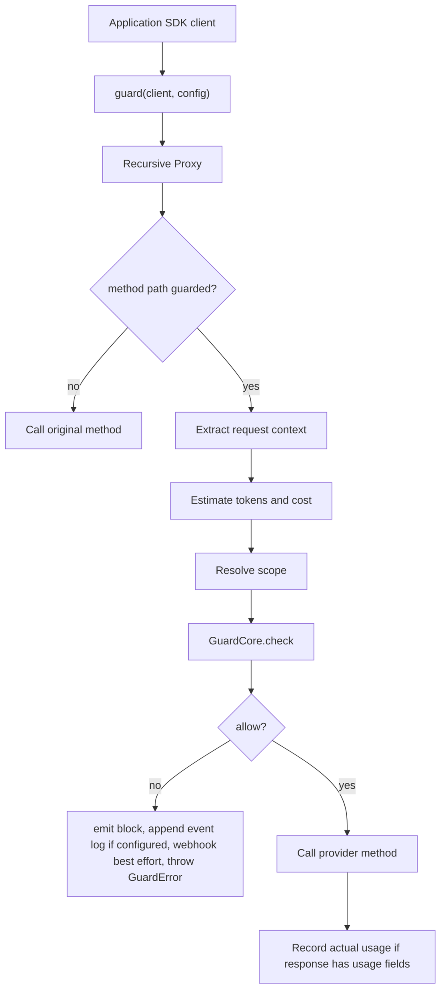

# AI CostGuard Architecture

This document describes the implementation that ships in `@salimassili/ai-costguard`.

## Package Boundaries

- Root import: `@salimassili/ai-costguard`
  - `guard`, `guardFunction`, `middleware`
  - `GuardError`, `createGuardState`
  - `DEFAULT_GUARDED_METHODS` (the coverage contract, exported so it can be asserted on)
  - pricing helpers, including `getPricingMeta`, `isBuiltInPricingStale`, `listBuiltInPricing`
  - `registerTokenizer`
  - public config/event/context types
- Shared-budget import: `@salimassili/ai-costguard/pro`
  - `GuardPro`
  - Redis client types
- Pricing import: `@salimassili/ai-costguard/pricing`
  - pricing registry helpers

Redis is intentionally isolated behind `/pro` so root-import users do not load `ioredis`. The
`/pro` subpath is **not** a paid or gated surface: it is the same MIT package, and the only reason it
is a separate entry point is to keep the optional Redis dependency off the root import path.
`ioredis` is declared as an *optional peer* dependency, so a plain `npm install` does not pull it.

## Build Layout

The package ships one declaration set and two module formats:

| Path | Format | Marker |
| --- | --- | --- |
| `dist/esm/**.js` | ES modules | `dist/esm/package.json` → `{"type":"module"}` |
| `dist/cjs/**.js` | CommonJS | `dist/cjs/package.json` → `{"type":"commonjs"}` |
| `dist/types/**.d.ts` | Declarations | Shared by both `exports` conditions |

Node resolves the *nearest* `package.json` to decide a file's module system. Writing an explicit
marker into each `dist` subtree makes both halves self-describing, so the dual build cannot silently
collapse into one format if the root `"type"` ever changes. The `exports` map pairs `types`,
`import`, `require`, and `default` conditions so neither consumer style reaches into a private path.

`tsconfig.json` is `noEmit` and is used for typechecking; `tsconfig.esm.json`, `tsconfig.cjs.json`,
and `tsconfig.types.json` are the three emit projects driven by `scripts/build.js`.

## Runtime Flow

```mermaid
flowchart TD
  A["Application SDK client"] --> B["guard(client, config)"]
  B --> C["Recursive Proxy"]
  C --> D{"method path guarded?"}
  D -- "no" --> E["Call original method"]
  D -- "yes" --> F["Extract request context"]
  F --> G["Estimate tokens and cost"]
  G --> H["Resolve scope"]
  H --> I["GuardCore.check"]
  I --> J{"allow?"}
  J -- "no" --> K["emit block, append event log if configured, webhook best effort, throw GuardError"]
  J -- "yes" --> L["Call provider method"]
  L --> M["Record actual usage if response has usage fields"]
```

`guardFunction(fn, config)` adapts function-style SDKs into the same `GuardCore` flow by protecting a synthetic `run` method.

## Guarded Methods

Default method paths:

- `chat.completions.create`
- `completions.create`
- `responses.create`
- `messages.create`

Applications can replace this list with `guardedMethods`. The default list is exported as
`DEFAULT_GUARDED_METHODS` so coverage is a value you can assert on rather than a claim in a README.
Any method not on the list is forwarded untouched and is never charged. This is an in-process proxy,
not an HTTP interceptor: `globalThis.fetch` is never patched. See `docs/COVERAGE.md`.

## Scope Model

Scopes isolate budget and behavior history. A scope can include:

- `projectId`
- `userId`
- `sessionId`

If no scope is configured, all calls use the `default` scope. Prompt and retry histories are pruned by `historyTtlMs`. Scope keys use structured serialization rather than delimiters. Identifiers are bounded to 256 characters and new process-local scopes are blocked after `maxScopes` (default 10,000) so budget state is never silently evicted.

## Accounting Model

The guard tracks estimates before provider execution:

- `attemptedCost`: all guarded attempts, allowed or blocked
- `reservedCost`: estimated cost reserved for allowed requests; **the only value used for budget enforcement**
- `totalCost`: deprecated compatibility alias for `reservedCost`
- `blockedCost`: estimated spend blocked before provider execution; never actual spend
- `actualCost`: provider-reported usage, when available; observability only

The invariant `attemptedCost == reservedCost + blockedCost` holds at all times, per scope and
process-wide, on the micro-cent storage grid (asserted with a `1e-12` tolerance rather than raw
float equality, because summing two rounded totals can differ by one binary ULP).

**Money scale.** All money is stored and compared at micro-cent precision (1e-6 USD), and rounding is
applied at the single point where money is added. This is a correctness requirement, not cosmetics.
Raw IEEE-754 accumulation drifts: twenty `$0.05` requests sum to `0.9500000000000001`, and a naive
`reserved + estimated <= budget` test would then reject the twentieth request even though it costs
exactly the budget it was approved against. Adding on the rounded scale keeps the stored balance, the
comparison, and the reported totals on one consistent scale, so they cannot disagree. The budget
ceiling is inclusive.

**Reservations are never refunded.** Budget enforcement uses estimated reserved spend because the
decision happens before the provider call, and because the guard cannot prove a failed request created
no billable work. A provider failure keeps its reservation; a retry is a second reservation. Actual
usage is additive observability data, reconciled at most once per request context, and never reverses
a decision. See `docs/ACCOUNTING.md`.

## Concurrency Model

`GuardCore.check()` is fully synchronous. Between reading `scope.reservedCost` for the budget test and
writing it back for the reservation there is no `await`, no user callback, and no I/O. All side
effects — event emission, the JSONL append, alerts — happen *after* the reservation is committed, in
`commitReservation()`. That ordering is what makes the guarantee real rather than best-effort: a
second in-process caller always observes the first caller's reservation.

The guarantee covers any number of concurrent `Promise.all` callers in one process, and guards that
share one `GuardState`. It does **not** cross an address-space boundary. `worker_threads`, `cluster`
workers, containers, and serverless isolates each hold their own balance; those need a shared store.
See `docs/SHARED-BUDGET.md`.

Streaming requests are rejected before provider execution because the package does not claim safe final-usage reconciliation for async streams.
Guarded requests must provide a finite output token limit (`max_tokens`, `max_completion_tokens`, `maxTokens`, or `max_output_tokens`); requests without one are rejected with `OUTPUT_LIMIT_REQUIRED` rather than assigned an arbitrary default.

## Behavior Detection

Loop detection uses character trigram cosine similarity. A prompt is blocked when at least `loopDetection.minHistorySize` recent prompts in the same scope exceed `loopDetection.similarityThreshold` inside the configured `loopDetection.windowSize`. Legacy `loopSimilarityThreshold` and `loopMinRepeats` options are still accepted for compatibility.

Retry detection uses conservative retry/failure keywords and scoped retry history. It is heuristic and intentionally configurable.

`guard()` can observe application-level repeated calls. It cannot intercept retries performed internally by a provider SDK after the guarded method has started.

## Local Dashboard

`eventLogPath` enables opt-in JSONL event records. Prompt text is redacted unless `eventLogPrompt: 'preview'` is set.

The CLI `dashboard` command reads that local file and serves a small HTTP view on `127.0.0.1` by default. It does not send telemetry or aggregate data across machines.

## Non-Goals

This repository does not currently ship:

- hosted dashboards
- proxy server
- API-key authentication layer
- multi-tenant SaaS control plane
- persistent prompt database
- provider billing reconciliation
- semantic embedding loop detection
- streaming usage reconciliation
